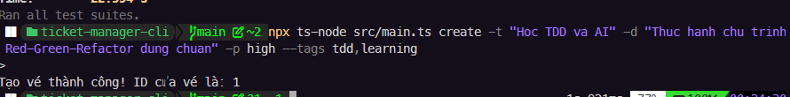
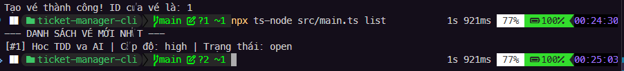
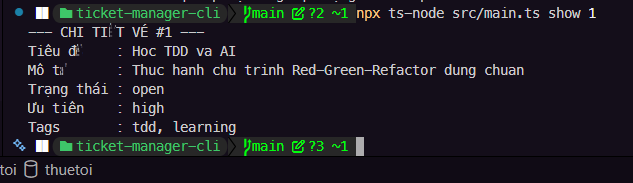
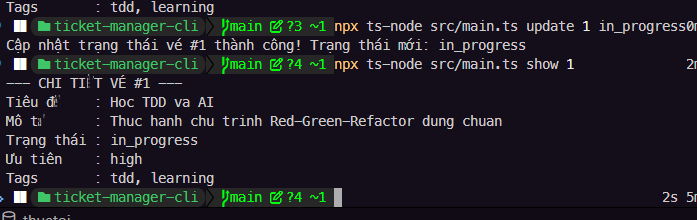
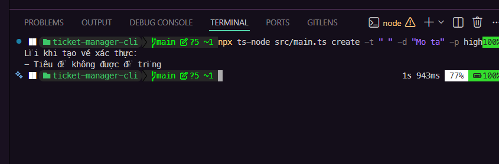

# Ticket Manager CLI

Ứng dụng quản lý Ticket trên Terminal viết bằng Node.js, TypeScript và ứng dụng triết lý Test-Driven Development (TDD).

## Các Tính Năng và Ảnh Demo

### 1. Tạo Ticket Mới (create)

Cú pháp:
```bash
npx ts-node src/main.ts create -t "<tiêu đề>" -d "<mô tả>" -p <low|medium|high> [--tags <tag1,tag2>]
```

Ví dụ:
```bash
npx ts-node src/main.ts create -t "Sửa lỗi đăng nhập" -d "Người dùng không thể đăng nhập bằng Google" -p high --tags bug,ui
```

Ảnh demo:


### 2. Xem Danh Sách Ticket (list)

Xem toàn bộ:
```bash
npx ts-node src/main.ts list
```

Lọc theo trạng thái và độ ưu tiên:
```bash
npx ts-node src/main.ts list -s open -p high
```

Lọc theo thẻ tag:
```bash
npx ts-node src/main.ts list --tags bug
```

Ảnh demo:


### 3. Xem Chi Tiết Một Ticket (show)

Cú pháp:
```bash
npx ts-node src/main.ts show <id>
```

Ví dụ:
```bash
npx ts-node src/main.ts show 1
```

Ảnh demo:


### 4. Cập Nhật Trạng Thái Ticket (update)

Cú pháp:
```bash
npx ts-node src/main.ts update <id> <open|in_progress|done>
```

Ví dụ:
```bash
npx ts-node src/main.ts update 1 in_progress
```

Ảnh demo:


### 5. Xử Lý Lỗi và Xác Thực (Error Handling)

Hệ thống tự động bắt và hiển thị lỗi xác thực hoặc lỗi hệ thống tệp tin bị hỏng một cách gọn gàng, không để lộ stack trace.

Ảnh demo:


---

## Minh Chứng Chu Trình TDD (Red-Green-Refactor)

Dưới đây là liên kết đến các ảnh chụp màn hình ghi nhận từng giai đoạn phát triển hướng kiểm thử (TDD):

### Pha Đỏ (Red Phase - Viết Test Lỗi Trước)
- [Bước 1: Chưa định nghĩa Ticket Model](screenshot/redphase_01_nomodel.png)
- [Bước 2: Thiếu trường tags trong Ticket Model](screenshot/redphase_02_notagsfield.png)
- [Bước 3: Viết test lưu/tải dữ liệu file JSON lỗi](screenshot/redphase_03_failingtestsjsonstorage.png)
- [Bước 4: Viết test tạo ticket lỗi cho TicketService](screenshot/redphase_04_testformethodcreate.png)
- [Bước 5: Thêm test case lỗi cho các nghiệp vụ](screenshot/redphase_05.png)
- [Bước 6: Test lỗi luồng CLI hiển thị danh sách](screenshot/redphase_06.png)
- [Bước 7: Test lỗi luồng CLI tìm và cập nhật trạng thái](screenshot/redphase_07.png)
- [Bước 8: Test lỗi trường hợp nhập thiếu mô tả](screenshot/redphase_08.png)
- [Bước 9: Test lỗi tệp tin JSON bị rỗng](screenshot/redphase_09.png)
- [Bước 10: Test lỗi lọc danh sách theo thẻ tag không tồn tại](screenshot/redphase_10.png)
- [Bước 11: Test lỗi cập nhật trạng thái không hợp lệ](screenshot/redphase_11.png)
- [Bước 12: Test lỗi hệ thống file bị hạn chế quyền ghi](screenshot/redphase_12.png)
- [Bước 13: Test lỗi tệp tin JSON bị lỗi định dạng cú pháp](screenshot/redphase_13.png)

### Pha Xanh (Green Phase - Viết Code Đạt Yêu Cầu Test)
- [Bước 1: Hoàn thành cấu trúc Ticket Model cơ bản](screenshot/greenphase_01_passticketmodel.png)
- [Bước 2: Triển khai thêm trường tags vào Ticket Model](screenshot/greenphase_02_addtagsfield.png)
- [Bước 3: Hoàn thành lớp JsonStorage lưu trữ dữ liệu](screenshot/greenphase_03_addjsonstorage.png)
- [Bước 4: Triển khai hàm tạo ticket trong TicketService](screenshot/greenphase_04.png)
- [Bước 5: Pass test trường hợp lọc ticket theo trạng thái](screenshot/greenphase_05.png)
- [Bước 6: Pass test lệnh CLI list ticket hiển thị danh sách](screenshot/greenphase_06.png)
- [Bước 7: Pass test lệnh CLI update trạng thái ticket](screenshot/greenphase_07.png)
- [Bước 8: Bổ sung mô tả và pass các asserts kiểm thử CLI](screenshot/greenphase_08.png)
- [Bước 9: Hoàn thiện logic xử lý file trống](screenshot/greenphase_09.png)
- [Bước 10: Pass bộ test lọc theo tags của CLI list](screenshot/greenphase_10.png)
- [Bước 11: Hoàn tất logic cập nhật trạng thái hợp lệ](screenshot/greenphase_11.png)
- [Bước 12: Xử lý ngoại lệ file hệ thống ghi thành công](screenshot/greenphase_12.png)
- [Bước 13: Bắt lỗi và hoàn thành kiểm thử tệp JSON hỏng](screenshot/greenphase_13.png)

### Pha Tái Cấu Trúc (Refactor Phase - Tối Ưu Hóa Mã Nguồn)
- [Bước 1: Tối ưu chuyển đổi Model từ Interface sang Class](screenshot/refactor_01_interfacetoclass.png)
- [Bước 7: Tái cấu trúc tách hàm tìm kiếm ID dùng chung](screenshot/refactor_07.png)
- [Bước 10: Tái cấu trúc dùng map/join thay cho forEach để làm sạch code hiển thị](screenshot/refactor_10.png)

---

## Hướng Dẫn Thiết Lập

### 1. Cài đặt các gói phụ thuộc
Chạy lệnh sau trong thư mục ticket-manager-cli để tải các thư viện:
```bash
npm install
```

### 2. Kiểm thử phần mềm
Chạy toàn bộ các bài unit test và integration test:
```bash
npm test
```